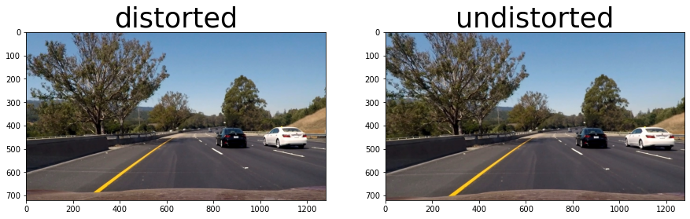
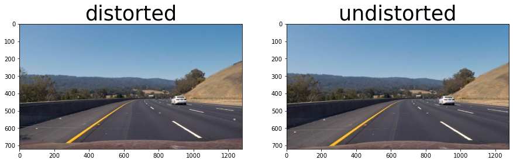
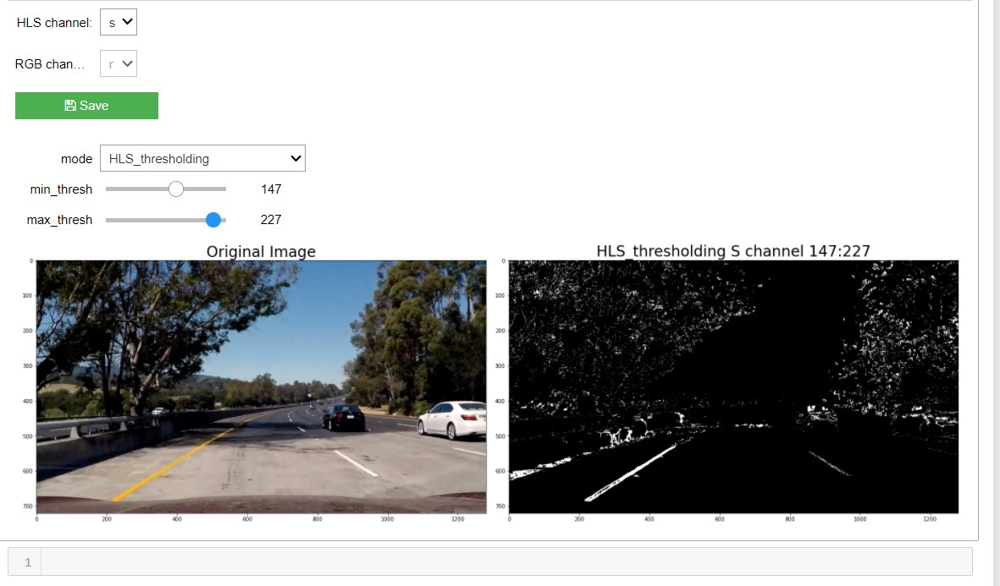
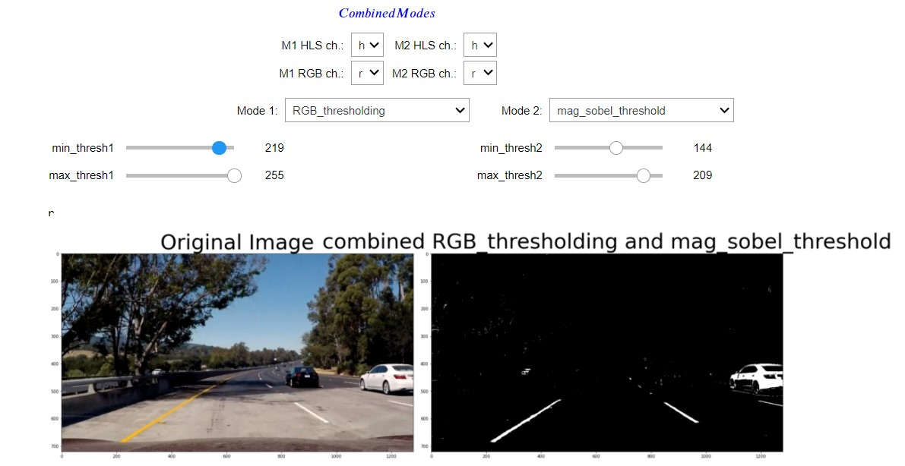
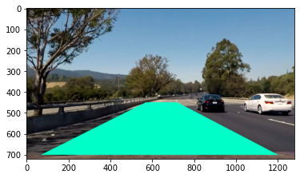
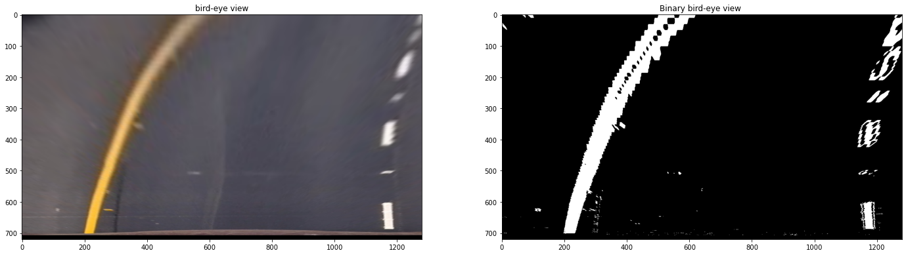
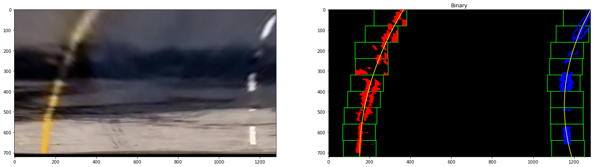
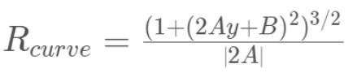
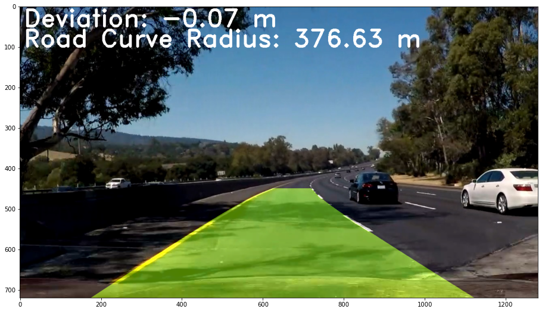

# Advanced Lane Finding
Advanced Road Lane Lines detection pipeline with Computer Vision.
[Notebook](/src/Advanced_lane.ipynb)


## The pipeline is the following:

* Computing the camera calibration matrix and distortion coefficients given a set of chessboard images.
* Appling a distortion correction to raw images.
* Using color transforms, gradients, etc., to create a thresholded binary image.
* Applying a perspective transform to rectify binary image ("birds-eye view").
* Detecting lane pixels and fit to find the lane boundary.
* Determining the curvature of the lane and vehicle position with respect to the center.
* Warping the detected lane boundaries back onto the original image.
* Outputting visual display of the lane boundaries and numerical estimation of lane curvature and vehicle position.
# Steps
## Camera Calibration
The first step is very important for the whole processing pipeline, in which we get the calibration matrix and coefficients of the used camera, these matrices will be very vital for the distortion step.<br /> 
I implemented  `get_camera_matrices()` which iterates over the chessboard calibration images in `camer_cal` folder then extratct ChessboardCorners and populates an imagepoints array that holds all corner points from all chessboard images if possible. <br>


Now, after populating `objpoints` and `imgpoints` lists, we are ready to go for calibration. We can use the function, `cv2.calibrateCamera()` which returns the camera matrix, distortion coefficients, rotation and translation vectors etc.<br>
Then I created a pickle file `camera_matrices.p` to save the camera's intrinsic properties to be used later for the same camera without the need to run the calibration function again(this function takes a lot of time to finish running). 


```python
#chessboard photos calibration constants
NX, NY = (9, 6)
CALIBRATION_IMAGES_PATH = '../camera_cal/'
def get_camera_matrices():
    # prepare object points, like (0,0,0), (1,0,0), (2,0,0) ....,(6,5,0)
    objp = np.zeros((NX*NY, 3), np.float32)
    objp[:, :2] = np.mgrid[0:NX, 0:NY].T.reshape(-1, 2)
    # Arrays to store object points and image points from all the images.
    objpoints = []  # 3d points in real world space
    imgpoints = []  # 2d points in image plane.
    # Make a list of calibration images
    path_pattern = CALIBRATION_IMAGES_PATH+'calibration*.jpg'
    images = glob.glob(path_pattern)
    # Step through the list and search for chessboard corners
    img_size = tuple()
    for idx, fname in enumerate(images):
        curr_image = cv2.imread(fname)
        gray = cv2.cvtColor(curr_image, cv2.COLOR_BGR2GRAY)
        ret, corners = cv2.findChessboardCorners(gray, (NX, NY), None)
        # If found, add object points, image points
        if ret == True:
            objpoints.append(objp)
            imgpoints.append(corners)
        img_size = (gray.shape[1], gray.shape[0])
    # Do camera calibration given object points and image points
    ret, mtx, dist, rvecs, tvecs = cv2.calibrateCamera(
        objpoints, imgpoints, img_size, None, None)    
    if ret:
        data_camera = {'mtx':mtx,'dist':dist}
        with open('camera_matrices.p','wb') as f :
            pickle.dump(data_camera,f)
        print('done')
        return mtx, dist, rvecs, tvecs
    else:
        raise("ERROR while calibration")
```
## Undistortion
Now, after having camera intrinsic properties saved, I successfuly implemented  `undistort()` which takes distorted image and returns the undistorted version of it<br> 
```python
def undistort(img,camera_file_path='camera_matrices.p'):
    """
    undistorts the given img with the help of camera intrinsic properties
    """
    if camera_file_path not in os.listdir('.'):
        print("writing new camera file")
        mtx,dist,_,_ = get_camera_matrices(input_image)  
    else : 
        camera_file= open(camera_file_path,'rb')
        camera_matrices =pickle.load(camera_file)
        mtx,dist = camera_matrices['mtx'], camera_matrices['dist']    
    undistorted = cv2.undistort(img, mtx, dist, None, mtx)
    return undistorted
```
I used this function to undistort road frames in the [test_images](./test_images) folder.
Here is the result:<br>



## Perspective warping of an image
This step is just for eductational purposes to try warping chessboard images,the core of this step is the process of finding the **source** and **destination points**, which is a trial&error process untill finding points that correspond to the 4 outer corners in a chessboard image.<br>
**So, I implemented the following utiltiy functions:**<br> 
1. `get_chess_calibration_points(img,marginx=MARGINX_OF_OBJECT_IMAGE,marginy=MARGINY_OF_OBJECT_IMAGE,visualize=False)` <br>
2. `visualize_points(points, img)` <br>

```python
MARGINX_OF_OBJECT_IMAGE,  MARGINY_OF_OBJECT_IMAGE = 136, 100
def get_chess_calibration_points(img,marginx=MARGINX_OF_OBJECT_IMAGE,marginy=MARGINY_OF_OBJECT_IMAGE,visualize=False):
    """
    returns the outer 4 corners detected in the chessboard pattern as source and destination np.array 
    of points in the same order
    """
    img_copy = np.copy(img)
    h, w = img_copy.shape[:2]
    NX, NY = (9, 6)
    gray = cv2.cvtColor(img_copy, cv2.COLOR_BGR2GRAY)
    corner_points = [(marginx-19, marginy+60), (w-marginx+96, marginy+71),
                     (marginx+110, h-marginy+23), (w-marginx-65, h-marginy+15)]
    if visualize:
        visualize_points(corner_points, img_copy)
    ret, corners = cv2.findChessboardCorners(gray, (NX, NY), None)
    dst = np.float32(corner_points)
    src = np.float32([corners[0], corners[NX-1], corners[-NY], corners[-1]])
    return src, dst

def visualize_points(points, img):
    """
    Visualizes the given points in the given image 
    """
    image_copy=np.copy(img)
    for point in points:
        cv2.circle(image_copy, point, radius=7, color=(0, 0, 255), thickness=-20)
    plt.imshow( image_copy)
```

## Color transforms, gradients
we can do two types of thresholding:
1. **Color Thresholding (rgb,hls,hsv,etc,.)**
2. **gradient thresholding (sobelx, sobely, sobel_Magnitude, sobel_Direction)**
3. **we can combine group of transforms and gradients**  <br>

so we have a lot of thresholding combinations, to find the best thresholds, manual tuning is required, so I created an interactive UI in the jupyter notebook for tuning the color transforms and gradients. 



After a lot of tunning and after trying various color transformations and gradients, The best combination that gave me the highest performance was: <br>
| Type              | lower threshold | upper threshold |
|-------------------|-----------------|-----------------|
| RGB R channel     | 225             | 255             |
| HLS S channel     | 180             | 255             |
| Sobel X direction | 20              | 100             |

<br/>
<br/>
<br/>

## Perspective Transform "Birds-Eye View"
The most exhausting part of this step was finding the best set of source points that form the corners of an Isosceles trapezoid, these points along with dst points, were used as input to `cv2.getPerspectiveTransform()` which returns the transformation matrix `M`, if the order of the function arguments is inverted, the function returns the inverse of `M` which will be used later to transform the image from bird's eye view to camera view.<br/>
 <br/>
Using `M`, the next step is applying `cv2.warpPerspective()` to both the binary image and the colored image, the result is the birds-eye view:<br/>
 <br/>

## Detecting lane pixels and fit to find the lane boundary
I created `find_lane_pixels(binary_warped)` which uses the sliding windows technique to find lane pixels, I used the following hyper-parameters:<br/>
```python
    #  the number of sliding windows
    nwindows = 9
    #  the width of the windows +/- margin
    margin = 80
    #  minimum number of pixels found to recenter window
    minpix = 45
```
this Function returns `leftx, lefty, rightx, righty,` which are the pixel coordinates that will be used later in `fit_polynomial()` function which calculates the left and right polynomial equations that fit the lane pixels
 

## Determining the curvature of the lane and vehicle position with respect to center

The left and right curvature radii are easily calculated in `measure_curvature_real()` function, and the central curvature radius is the median of left and right Rad.
This function uses the polynomial-fit points of left and right curves, then converts them to meters, and using this formula:<br>  <br>
The vehicle position to the center is computed in `distance_to_center()` by subtracting the horizontal **midpoint between the lower ends of the left and right lanes** from the **horizontal midpoint of the frame: Width/2** then the result is converted to meters.

## Warping the detected lane boundaries back
Using `M_Inverse` that was calculated early in `view_bird_eyes()`, the frame is warped back to the original view after detecting the lane boundaries and overlaying them on the original frame.
 

# Discussion: Problems faced & Pipeline failure cases
My pipeline was robust at nearly all parts of the road, except the frames where shadows appear or at the transitions between bright and dark road areas, the lane shape catastrophically bounced at these areas, so I was stuck at this point until I started tuning and trying multiple color transformation, and changing the location of the source points which were used in the Perspective Transform "Birds-Eye View" function. Increasing the area of the **Perspective-transform trapezoid** especially in y-direction helped me fix the bouncing-lane issue. <br>
Pipeline output for the project_video: 
[Video youtube link](https://www.youtube.com/watch?v=cg6LrVFItwc)
****
* The pipeline could fail at cars moving on roads with extreme weather (e.g., rainy day, snow-covered lane, etc.).
* It might also fail when any interrupting car passes on any line.
* Broken road may result in a noisy binary image with many white pixels due to broken asphalt of the road,this case would need additional image filtering. 
